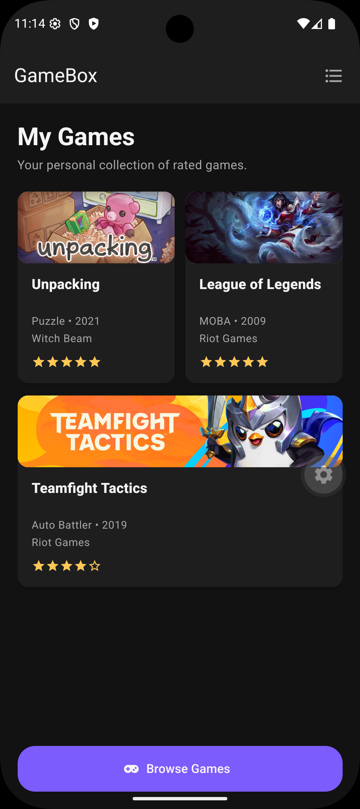
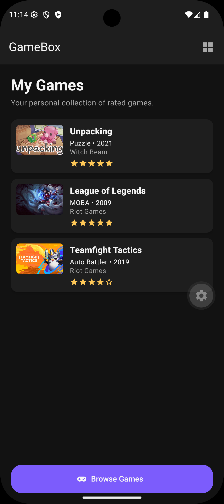
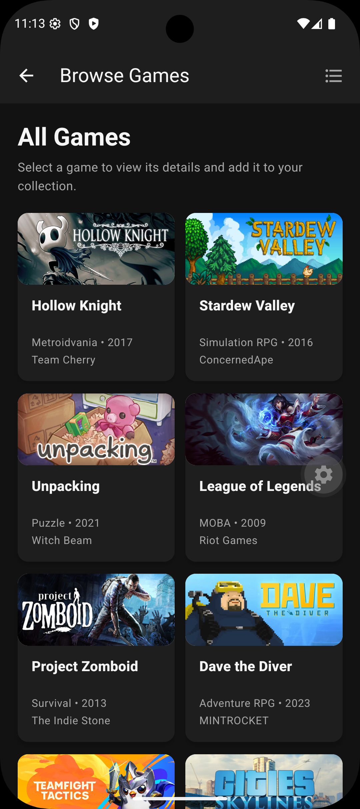
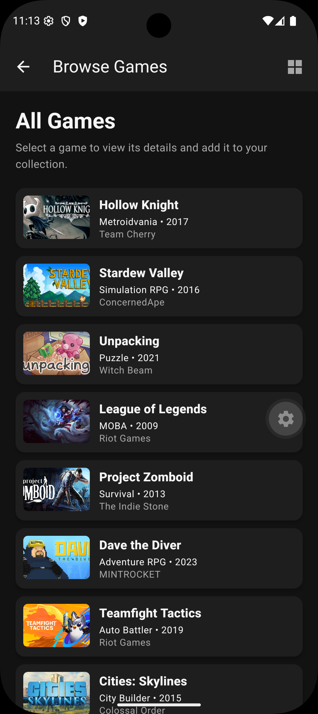
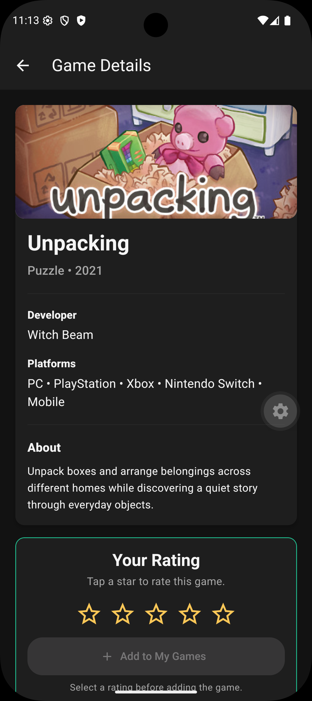
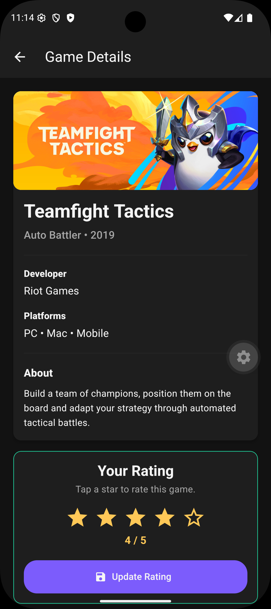

# GameBox

GameBox is a video game rating application similar to Letterboxd, but for games. Users can browse games, see game details, rate games with stars out of 5, and add games to their collection. On the Home and Browse screens, I also added two different view options, so the user can display the games either as a list or as cards using reusable List and Card components.

## Screenshots

| # | Screen | File |
|---|---|---|
| 1 | Home screen card view | `screenshots/01-home-card-view.png` |
| 2 | Home screen list view | `screenshots/02-home-list-view.png` |
| 3 | Browse screen card view | `screenshots/03-browse-card-view.png` |
| 4 | Browse screen list view | `screenshots/04-browse-list-view.png` |
| 5 | Detail screen before rating | `screenshots/05-detail-before-rating.png` |
| 6 | Detail screen after rating | `screenshots/06-detail-after-rating.png` |

## Technologies

- React Native
- Expo
- React Navigation
- React Native Paper
- Local JSON data
