# GameBox

GameBox is a video game rating application similar to Letterboxd, but for games. Users can browse games, see game details, rate games with stars out of 5, and add games to their collection.

The application was extended with a REST API feature that retrieves live game deal data from the CheapShark API. The Game Deals screen fetches data with `fetch` and `async/await`, stores the retrieved deals in React state, displays them with `FlatList`, supports loading and error states, filters the already loaded data locally, and opens a details screen for a selected deal.

The project also includes platform-specific development examples using `Platform.OS`, `Platform.select()`, and separate `PlatformInfo.android.js`, `PlatformInfo.ios.js`, and `PlatformInfo.web.js` components.

## Screenshots

| # | Screen | File |
|---|---|---|
| 1 | Home screen card view | `screenshots/01-home-card-view.png` |
| 2 | Home screen list view | `screenshots/02-home-list-view.png` |
| 3 | Browse screen card view | `screenshots/03-browse-card-view.png` |
| 4 | Browse screen list view | `screenshots/04-browse-list-view.png` |
| 5 | Detail screen before rating | `screenshots/05-detail-before-rating.png` |
| 6 | Detail screen after rating | `screenshots/06-detail-after-rating.png` |
| 7 | Successfully retrieved CheapShark data | `screenshots/07-api-data-loaded.png` |
| 8 | Loading state | `screenshots/08-api-loading.png` |
| 9 | Filtering functionality | `screenshots/09-api-filtering.png` |
| 10 | Deal details screen | `screenshots/10-deal-details.png` |
| 11 | Platform-specific implementation | `screenshots/11-platform-specific-android.png` |

<table>
  <tr>
    <td align="center">
      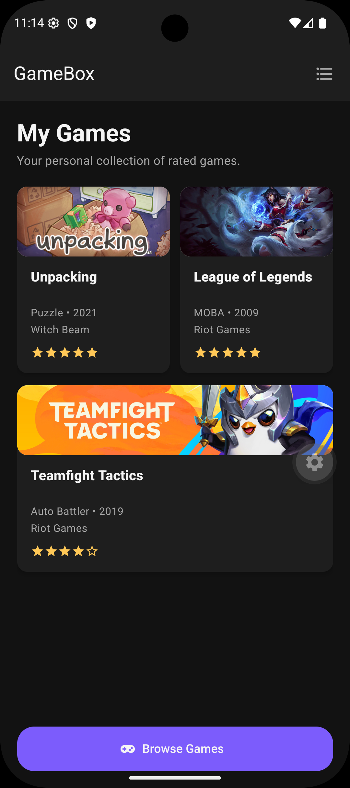
       
      Home card view
    </td>
    <td align="center">
      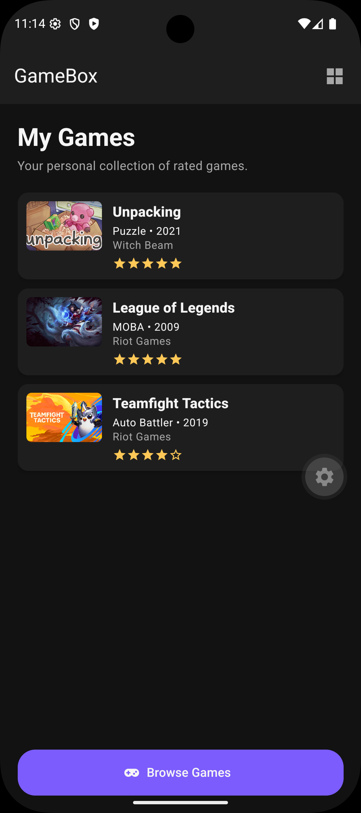
       
      Home list view
    </td>
    <td align="center">
      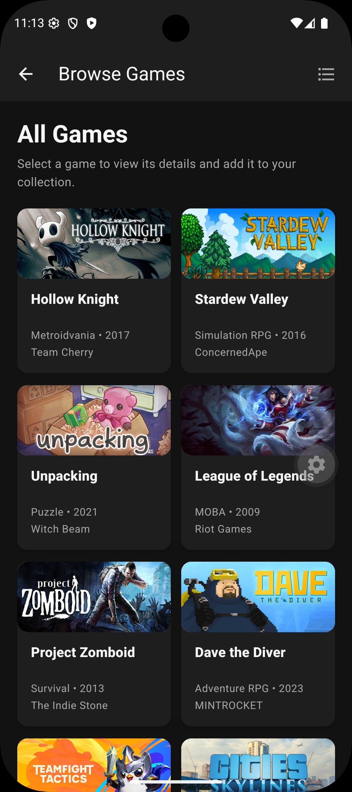
       
      Browse card view
    </td>
  </tr>
  <tr>
    <td align="center">
      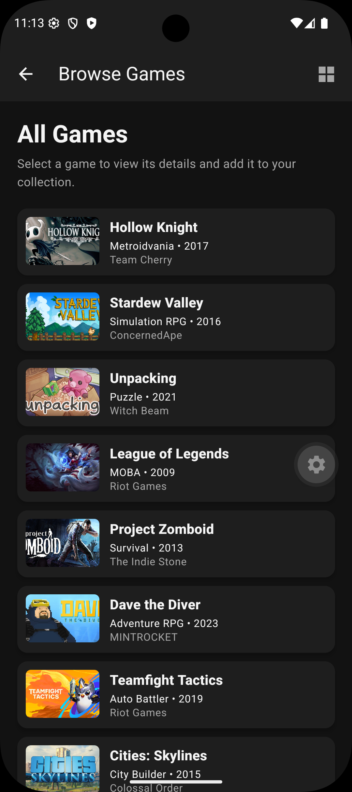
       
      Browse list view
    </td>
    <td align="center">
      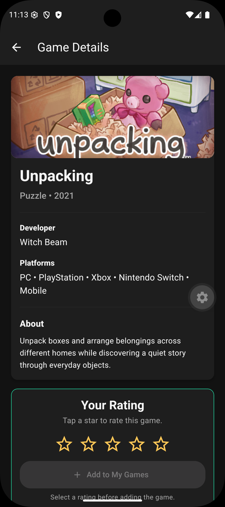
       
      Detail before rating
    </td>
    <td align="center">
      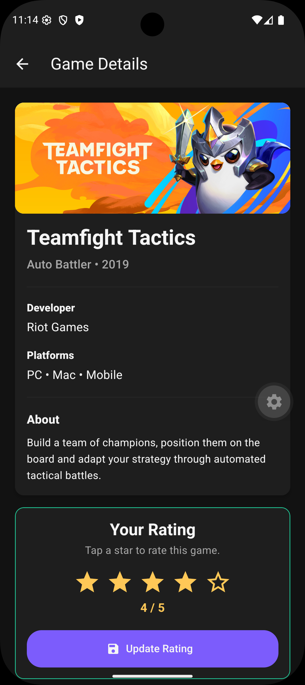
       
      Detail after rating
    </td>
  </tr>
</table>

### REST API and Platform Screenshots

<table>
  <tr>
    <td align="center">
      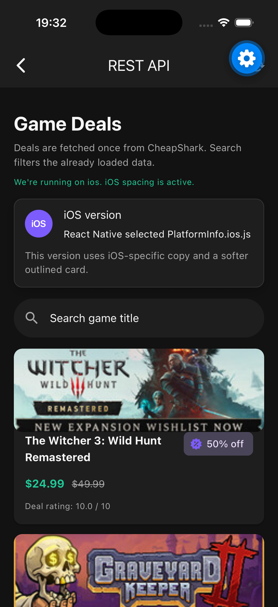
       
      Retrieved API data
    </td>
    <td align="center">
      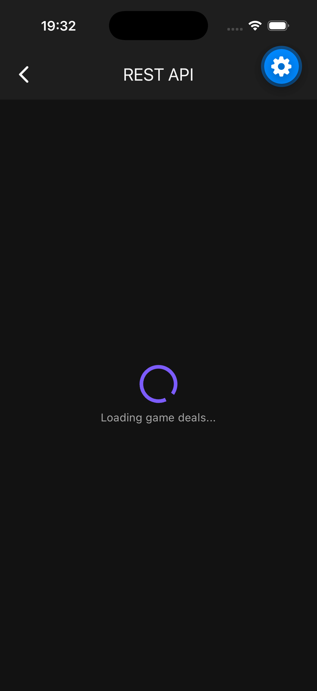
       
      Loading or error state
    </td>
    <td align="center">
      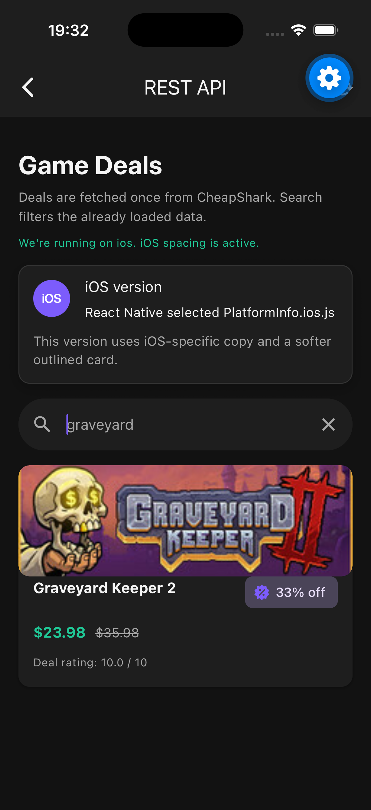
       
      Local filtering
    </td>
  </tr>
  <tr>
    <td align="center">
      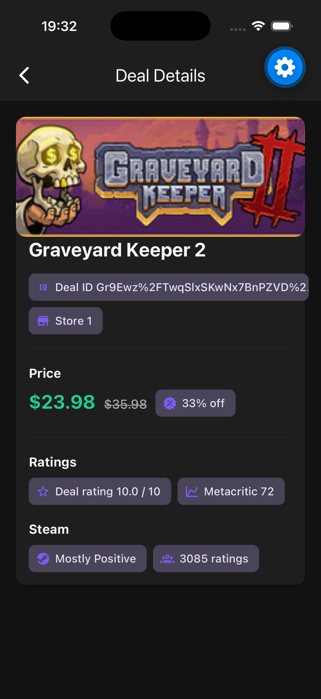
       
      Deal details
    </td>
    <td align="center">
      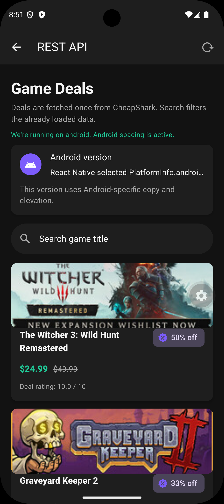
       
      Platform-specific UI
    </td>
  </tr>
</table>

## REST API Feature

- API: `https://www.cheapshark.com/api/1.0/deals?storeID=1&upperPrice=30&pageSize=30`
- The API returns an array of game deal objects.
- The app displays meaningful fields such as title, thumbnail, sale price, normal price, savings, deal rating, store ID, Steam rating, and Metacritic score.
- The request is made with `fetch` and `async/await`.
- The response is converted with `response.json()`.
- The retrieved data is stored in React state.
- The deals are displayed with `FlatList` and React Native Paper components.

## Loading, Error, and Filtering

- Initial state: the user can press `Load Deals`.
- Loading state: the app displays an `ActivityIndicator`.
- Success state: the app displays the retrieved game deals.
- Error state: the app displays an error message and a `Retry` button.
- Filtering happens locally after the data has already been fetched.
- The search bar filters deals by game title or store ID using `filter()`, `includes()`, and `toLowerCase()`.

## Platform-Specific Development

- The Game Deals screen displays the current platform with `Platform.OS`.
- `Platform.select()` is used to apply platform-specific spacing and text.
- React Native automatically selects the correct `PlatformInfo` component:
  - `components/PlatformInfo.android.js`
  - `components/PlatformInfo.ios.js`
  - `components/PlatformInfo.web.js`
- As an additional platform difference, the app demonstrates shadows and elevation. Android uses `elevation`, while iOS uses shadow properties such as `shadowColor`, `shadowOpacity`, `shadowRadius`, and `shadowOffset`.

## Technologies

- React Native
- Expo
- React Navigation
- React Native Paper
- Local JSON data
- CheapShark REST API
- Platform-specific React Native modules
